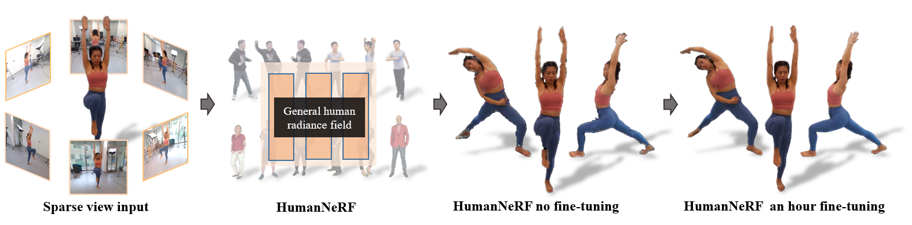

# HumanNeRF

 

A pytorch implementation of **HumanNeRF** (CVPR2022), as described in [_HumanNeRF : Efficiently Generated Human Radiance Field from Sparse Inputs_](https://openaccess.thecvf.com/content/CVPR2022/papers/Zhao_HumanNeRF_Efficiently_Generated_Human_Radiance_Field_From_Sparse_Inputs_CVPR_2022_paper.pdf).

> __HumanNeRF : Efficiently Generated Human Radiance Field from Sparse Inputs__  
> [Fuqiang Zhao](https://zhaofuq.github.io/), Wei Yang, [Jiakai Zhang](https://jiakai-zhang.github.io/), Pei Lin, Yingliang Zhang, [Jingyi Yu](http://www.yu-jingyi.com/), [Lan Xu](http://xu-lan.com/)  
> __[Project page](https://zhaofuq.github.io/humannerf/)&nbsp;/ [Paper](https://openaccess.thecvf.com/content/CVPR2022/papers/Zhao_HumanNeRF_Efficiently_Generated_Human_Radiance_Field_From_Sparse_Inputs_CVPR_2022_paper.pdf)&nbsp;/ [Video](https://youtu.be/CKeXnQiLCd4)&nbsp;/ [Data](https://drive.google.com/drive/folders/1P3OyAjTNh1V74OSPf0JJ1OnF-E6oklKB?usp=sharing)__

## Installation
Tested on Ubuntu 20.04 + Pytorch 1.10.1 + RTX3090

Install environment:
```sh
$ conda create -n humannerf python=3.8
$ conda activate humannerf
$ pip install torch==1.10.1+cu113 torchvision==0.11.2+cu113 torchaudio==0.10.1+cu113 -f https://download.pytorch.org/whl/cu113/torch_stable.html
$ pip install imageio pillow scikit-image opencv-python configargparse lpips kornia warmup_scheduler matplotlib test-tube imageio-ffmpeg
```
## Training
Please see each subsection for training or inference on different componenments. Available training datasets:

### Dataset
Our collected multi-view datasets are avaliable at [Google Driver](https://drive.google.com/drive/folders/1P3OyAjTNh1V74OSPf0JJ1OnF-E6oklKB?usp=sharing)

### Training nerf model
Run

```sh
$ cd tools
$ python train_net.py configs/config.yml --gpu 0
```
## Testing

### Testing nerf model
Run

```sh
$ cd tools
$ python render.py ${DATA_DIR} --output ${OUTPU_DIR} --render nerf --gpu 0
```

### Testing texture blending model
Run

```sh
$ cd tools
$ python render.py ${DATA_DIR} --output ${OUTPU_DIR} --render blending --gpu 0
```

## License and Citation

```bibtex
@InProceedings{Zhao_2022_CVPR,
    author    = {Zhao, Fuqiang and Yang, Wei and Zhang, Jiakai and Lin, Pei and Zhang, Yingliang and Yu, Jingyi and Xu, Lan},
    title     = {HumanNeRF: Efficiently Generated Human Radiance Field From Sparse Inputs},
    booktitle = {Proceedings of the IEEE/CVF Conference on Computer Vision and Pattern Recognition (CVPR)},
    month     = {June},
    year      = {2022},
    pages     = {7743-7753}
}
```